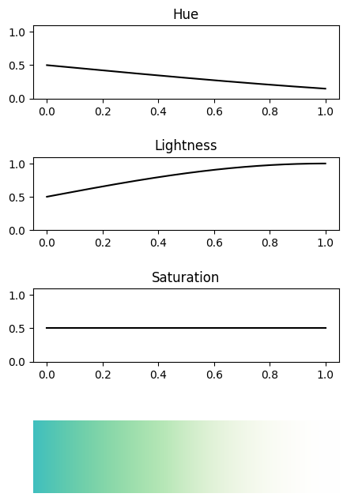
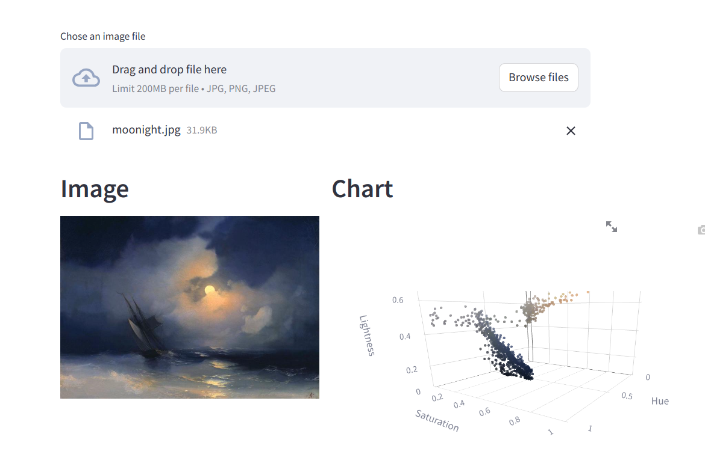

<h1 align="center">
Colta
</h1>

<p align="center">
Find the relationship between colors from a data-view~
</p>


# Features

- map signal to color band [Colornal.py](./Colornal.py)
- visualize image's colors with 3d [color_visual.py](./color_visual.py)

# Requirements

- Python
- numpy
- ploty
- streamlit

# Example

## Useage of Colornal class

```Python
import numpy as np
from Colornal import Colornal

N = 500
x = np.linspace(0, 1, N)

h = 0.5*np.sin(np.pi/4*x+np.pi) + 0.5
l = 0.5*np.sin(np.pi/2*x) + 0.5
s = 0.5*np.ones(N)
cs = Colornal(h,l,s)
cs.draw()
```

Then you can see



## colorvisual.py

```
streamlit run colorvisual.py
```

or

```
python -m streamlit run colorvisual.py
```




# Todo list
- [x] Signal to Color band
- [ ] Give a picture, draw a line, read the line's color signal
