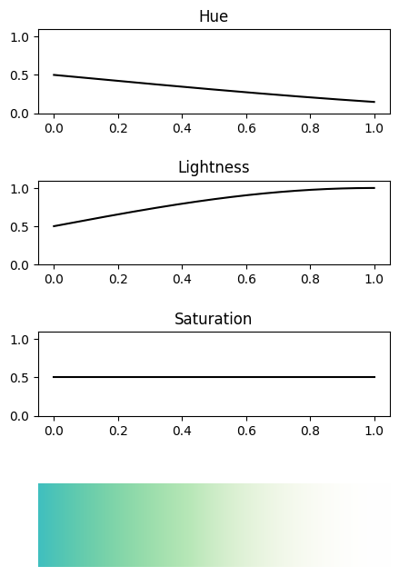

<h1 align="center">
Colornal
</h1>

<p align="center">
Make your signals colorful!
</p>

Visualize your signals as color band!

# Example

```Python
import numpy as np
from Colornal import Colornal

N = 500
x = np.linspace(0, 1, N)

h = 0.5*np.sin(np.pi/4*x+np.pi) + 0.5
l = 0.5*np.sin(np.pi/2*x) + 0.5
s = 0.5*np.ones(N)
cs = Colornal(h,l,s)
cs.draw()
```

Then you can see



# Todo list
- [x] Signal to Color band
- [ ] Give a picture, draw a line, read the line's color signal
